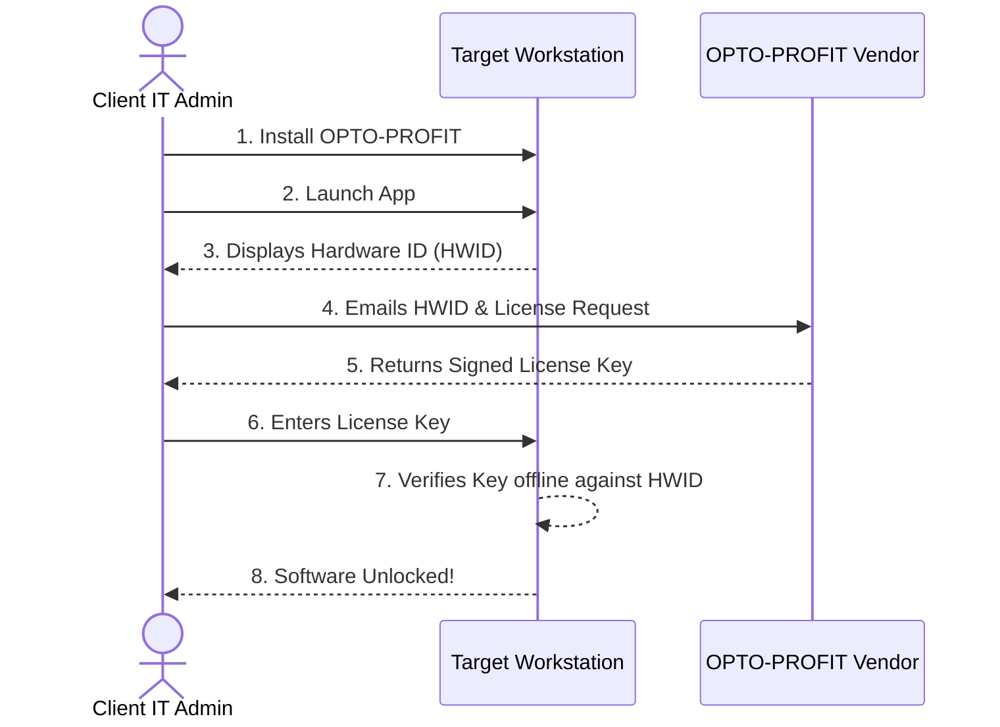

# OPTO-PROFIT: Licensing & Provisioning Guide

This document is intended for IT Administrators and Managers responsible for deploying and licensing the **OPTO-PROFIT** application across your organization. It outlines how our offline, highly secure licensing model works and the step-by-step process for provisioning access to your end-users.

---

## Table of Contents
1. [Introduction & Key Terms](#1-introduction--key-terms)
2. [Understanding the Licensing Model](#2-understanding-the-licensing-model)
3. [Step-by-Step Provisioning Process](#3-step-by-step-provisioning-process)
4. [Hardware Changes & License Transfers](#4-hardware-changes--license-transfers)
5. [Frequently Asked Questions (FAQ)](#5-frequently-asked-questions-faq)

---

## 1. Introduction & Key Terms

Before provisioning the software, it is important to understand the terminology used in our licensing system:

*   **Provisioning:** The administrative process of installing the software, requesting authorization, and unlocking it for an end-user to use.
*   **Hardware ID (HWID):** A unique, 16-character alphanumeric code (e.g., `27CCE96460FFE11E`) generated specifically by the physical hardware of a computer (usually combining the CPU ID and Motherboard Serial Number). It acts as a digital fingerprint for that specific machine.
*   **License Key:** A long, secure cryptographic string provided by the vendor. It contains encoded information (such as expiration date and authorized HWID) and is used to unlock the application.
*   **Offline-First Security:** Our software requires **zero internet connection**. It does not phone home to a server to verify licenses, ensuring maximum data privacy for your enterprise.

---

## 2. Understanding the Licensing Model

Because OPTO-PROFIT operates in highly secure, offline factory environments, we cannot use traditional cloud-based logins or subscription servers. Instead, we use an **Offline, Hardware-Locked** model.

1.  **Hardware-Locked:** Each license you purchase is bound to a single physical computer via its **HWID**. If a user attempts to copy the installed software and database to an unauthorized computer, the software will refuse to open.
2.  **Cryptographic Verification:** The License Key you receive is digitally signed by the vendor. The application checks this signature locally to ensure the key is authentic and hasn't expired.

---

## 3. Step-by-Step Provisioning Process

When a new employee or workstation requires access to OPTO-PROFIT, please follow this exact workflow:

### Step 3.1: Install the Software
Install the OPTO-PROFIT application on the target workstation using the provided `.exe` installer.

### Step 3.2: Retrieve the Hardware ID (HWID)
Because the license is tied to the physical machine, you must get the HWID *from the computer where the software will be used*.
1. Launch the OPTO-PROFIT application on the target workstation.
2. The application will halt at the **License Activation Screen**.
3. Locate the **Hardware ID** displayed on the screen.
4. Click the **Copy** button next to it.

### Step 3.3: Request the License Key
1. Compile an email or support ticket to your OPTO-PROFIT vendor representative.
2. Provide the following details:
    *   **User / Workstation Name:** (e.g., "Line 3 Terminal" or "John Doe")
    *   **Hardware ID (HWID):** Paste the code you copied in Step 3.2.
    *   **Requested Duration:** (e.g., 1 Year, Perpetual, etc., based on your contract).
3. The vendor will process this request and reply with a **License Key**.

### Step 3.4: Apply the License Key
1. Return to the target workstation and open OPTO-PROFIT.
2. On the **License Activation Screen**, paste the provided License Key into the input field.
3. Click **Activate**.
4. The software will verify the key against the machine's hardware and unlock immediately. The user can now use OPTO-PROFIT.

---

## 4. Hardware Changes & License Transfers

Because the license is strictly tied to the computer's motherboard and CPU, certain IT actions will invalidate the license:

### What invalidates a license?
*   Replacing the computer's motherboard.
*   Replacing the computer's primary CPU.
*   Moving the hard drive to a completely different computer.

### How to transfer a license (PC Replacement)
If a computer breaks or is scheduled for replacement, you can transfer the license:
1. Contact the vendor support team and notify them of the hardware replacement.
2. Provide the vendor with the **Old HWID** (to be decommissioned) and the **New HWID** (from the new machine).
3. The vendor will issue a replacement License Key for the new machine.

> [!WARNING]
> **Data Migration & Encryption**
> The local database (`optoprofit.db`) is encrypted using a key derived from the HWID. If you migrate the database to a new machine, you must use the software's built-in **Export / Import Profile (.opto)** functionality *before* decommissioning the old machine. Simply copying the `.db` file to a new PC will result in unreadable data due to the hardware lock.

---

## 5. Frequently Asked Questions (FAQ)

**Q: Do I need to connect the PC to the internet just once for activation?**
A: No. The activation process is entirely offline. The software mathematically verifies the License Key against the HWID locally.

**Q: What happens when a license expires?**
A: If you requested a time-limited license (e.g., 1 Year), the application will lock down on the expiration date and prompt the user to enter a new License Key. No data is lost; it simply remains inaccessible until a new valid key is provided.

**Q: Can I use one License Key on multiple machines if they are identical models?**
A: No. Even identical computer models have unique motherboard serial numbers. You must request a unique License Key for every individual machine.
