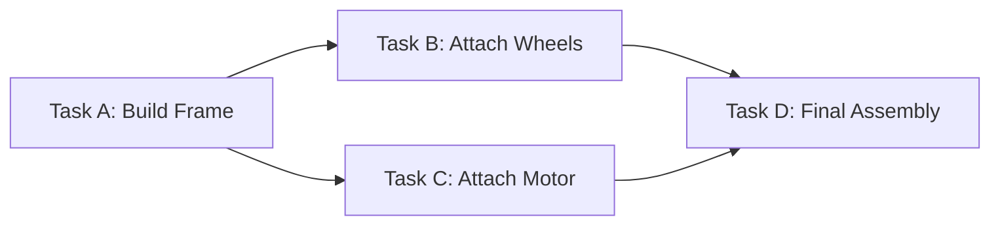

# OPTO-PROFIT: End-User Manual

Welcome to **OPTO-PROFIT**, your dedicated offline enterprise tool for assembly line optimization and project management. This manual will guide you step-by-step through installing, activating, and using the software, while explaining all the key terms you will encounter.

---

## Table of Contents
1. [Introduction to Key Terms](#1-introduction-to-key-terms)
2. [Installation & Licensing](#2-installation--licensing)
3. [Getting Started (First Launch)](#3-getting-started-first-launch)
4. [Creating & Managing Profiles (Projects)](#4-creating--managing-profiles-projects)
5. [Configuring Your Assembly Line](#5-configuring-your-assembly-line)
6. [Managing Tasks & Dependencies](#6-managing-tasks--dependencies)
7. [Data Sharing & Offline Collaboration](#7-data-sharing--offline-collaboration)
8. [Troubleshooting & Support](#8-troubleshooting--support)

---

## 1. Introduction to Key Terms

Before diving into the software, here are the core terms used in OPTO-PROFIT:

*   **Profile / Project:** A complete snapshot of your work. This includes all your tasks, configurations, and variables for a specific product or assembly line.
*   **Task:** A single unit of work on the assembly line (e.g., "Attach Screen", "Test Battery"). Each task has a specific duration (Time).
*   **Predecessor:** A task that must be completed *before* another task can begin. If Task B cannot start until Task A is finished, Task A is the predecessor to Task B.
*   **Zone / Zoning:** Physical or logical areas on your assembly floor (e.g., "Wet-Zone", "Clean-Room"). You can assign tasks to specific zones to ensure they happen in the right environment.
*   **Co-location:** A rule stating that two specific tasks *must* be performed at the same workstation or area.
*   **Separation:** A rule stating that two specific tasks *must not* be performed at the same workstation (e.g., sanding and painting).
*   **Hardware ID (HWID):** A unique alphanumeric fingerprint generated from your computer's physical hardware. OPTO-PROFIT uses this to securely lock your license to your machine.
*   **.opto File:** A secure, exportable file format used to save and share your OPTO-PROFIT Profiles offline with colleagues.

---

## 2. Installation & Licensing

OPTO-PROFIT is a strict **offline-first** application. It does not connect to the internet, cloud databases, or external servers.

### Step 2.1: Installation
1. Locate the OPTO-PROFIT Installer `.exe` file provided by your IT department.
2. Double-click the installer and follow the on-screen prompts.
3. Once installed, a shortcut will appear on your Desktop.

### Step 2.2: Retrieving Your Hardware ID
Because there is no internet connection, your license is manually tied to your PC.
1. Launch OPTO-PROFIT.
2. You will be greeted by the **License Activation** screen.
3. Locate the **Hardware ID** displayed on the screen (a long string of characters).
4. Click the **Copy** button next to it.
5. Email this Hardware ID to your IT Administrator or OPTO-PROFIT Support to request a license key.

### Step 2.3: Activating the Software
1. Once you receive your **License Key** via email, open OPTO-PROFIT.
2. Paste the License Key into the input box on the Activation screen.
3. Click **Activate**. You now have full access to the software.

---

## 3. Getting Started (First Launch)

When you successfully log in, you will be directed to the **Dashboard**.

*   **Dashboard View:** Here, you will see a summary of your recent Profiles (Projects) and key metrics.
*   **Generate PDF Report:** You can export the current dashboard overview, including the layout and metrics, by clicking the "GENERATE PDF REPORT" button at the top right of the Dashboard.
*   **Sidebar Navigation:** Use the left-hand menu to navigate between your Dashboard, Profiles, Task Manager, Layouts, Financials, and System Settings.

---

## 4. Creating & Managing Profiles (Projects)

To begin optimizing an assembly line, you need to create a Profile.

### Creating a New Profile
1. Navigate to the **Profiles** tab from the sidebar.
2. Click **Create New Profile**.
3. Enter a **Product Name** (e.g., "Electric Scooter V2").
4. Click **Save**. Your new Profile is now active.

---

## 5. Configuring Your Assembly Line

Inside your Profile, the **Config** tab allows you to set the rules and variables for your factory floor.

### Adding Variables
Variables are custom numbers you need for calculations (e.g., Shift Time).
1. Go to **Config > Variables**.
2. Click **Add Variable**. Provide a Label (e.g., "Shift Time"), a Value (e.g., 480), and a Unit (e.g., "Minutes").

### Setting Up Zones & Rules
1. **Custom Zones:** Define the areas of your factory (e.g., "High-Voltage Zone").
2. **Zone Exclusions:** Define zones that cannot be near each other.
3. **Co-locations & Separations:** Add task pairs that must be kept together or kept apart for safety and efficiency.
4. **Target Efficiency:** Set your desired assembly line efficiency percentage (e.g., 85%).

---

## 6. Managing Tasks & Dependencies

The core of OPTO-PROFIT is the **Task Manager**.

### Step 6.1: Adding Tasks
1. Go to the **Tasks** tab.
2. Click **Add Task**.
3. Fill in the Details:
    *   **Task ID:** A short identifier (e.g., "T-01").
    *   **Name:** Description of the work.
    *   **Time:** How long the task takes (in your preferred time unit).
    *   **Zone:** Select a zone if this task requires a specific physical location.

### Step 6.2: Setting Predecessors (Dependencies)
To ensure the assembly line flows correctly, link tasks together.
1. Select a Task to edit.
2. Under the **Predecessors** dropdown, select the Task ID(s) that must happen before this task.
3. Save your changes. The system will automatically map the sequence of events.

### Step 6.3: Manual Task Overrides
Sometimes the algorithm needs a human touch. In the **Layout** screen (Grid View):
1. You will see cards for each workstation.
2. You can click and drag tasks from one workstation card to another to manually balance the load.
3. The system will temporarily pause strict constraints and instantly recalculate your Efficiency and Takt Time.
4. Click **Reset to Optimized** if you wish to revert to the algorithm's plan.

*(Example: Task D has Predecessors B & C. Task A is the predecessor to both B & C.)*

---

## 7. Financial Analytics & What-If Scenarios

Once your line is optimized, navigate to the **Financial Analytics** tab to view your Return on Investment (ROI) and cost breakdowns.

### What-If Scenarios
You can interactively simulate changes to your business environment without altering your saved Config:
1. Use the **Demand (Units/Month)** slider to see the impact of scaling production.
2. Adjust the **Unit Price ($)** and **Unit Material Cost ($)** sliders to simulate pricing or supply chain shifts.
3. Adjust the **Operator Cost/Hr ($)** to model wage changes.
4. The financial metrics and break-even charts will update instantly.
5. Click **Reset to Actual** to restore the values from your original configuration.

---

## 8. Floor Layout Presets

The **Layout** screen provides a "Canvas View" for visualizing your physical factory floor.

1. **Move Workstations:** Click and drag the workstation cards around the grid to model your floor plan.
2. **Save a Preset:** In the left sidebar, under the "LAYOUT PRESETS" section, type a name (e.g., "U-Shape Tight") and click **SAVE**.
3. **Load a Preset:** Select a previously saved layout from the dropdown and click **LOAD** to instantly snap the workstations back into that configuration.

---

## 9. Data Sharing & Offline Collaboration

Because OPTO-PROFIT does not use the cloud, all data is securely stored on your local hard drive. If you need to share a project with a manager or colleague, you use **.opto files**.

### Exporting a Project
1. Open the Profile you wish to share.
2. Click the **Export** button in the top right corner.
3. The system will download a file ending in `.opto` to your computer.
4. You can now put this file on a USB drive or attach it to an internal corporate email.

### Importing a Project
1. When you receive an `.opto` file, simply double-click it.
2. Because OPTO-PROFIT is registered with Windows, the app will automatically open and securely import the Profile into your local database.

---

## 10. Troubleshooting & Support

**Q: The app says "License Invalid" but it was working yesterday.**
A: This usually happens if significant hardware changes were made to your computer (e.g., the motherboard or hard drive was replaced), which changes your Hardware ID. Please contact IT to request a new license.

**Q: Where is my data saved?**
A: All data is heavily encrypted and saved locally in your user profile folder. No data ever leaves your computer automatically.

**Q: I cannot double-click the `.opto` file to open it.**
A: If file associations are broken, you can manually import the file. Open OPTO-PROFIT, go to the Profiles tab, click **Import Profile**, and select your `.opto` file from the browser.

*For further assistance, please contact your internal IT Support Desk.*
