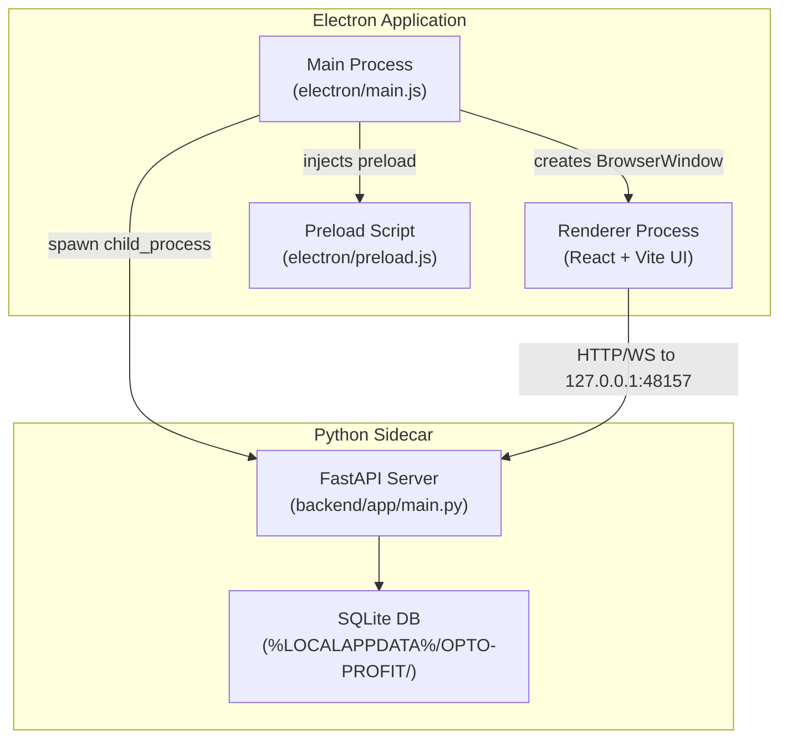

# Convert OPTO-PROFIT to Electron Desktop Application

The current OPTO-PROFIT project is a full-stack web app (React + Vite frontend, FastAPI + SQLite backend) with an existing PyInstaller + pywebview desktop packaging setup. The goal is to replace that with a proper **Electron** desktop application that provides native menus, system tray integration, auto-updates, and a polished desktop experience.

## Architecture Overview



**Key architectural decisions:**
- **Electron main process** spawns the FastAPI backend as a **sidecar child process** (packaged as a standalone `.exe` via PyInstaller, same as today).
- **BrowserWindow** loads the React frontend — either from the Vite dev server (in dev) or from the bundled `dist/` folder (in production).
- The existing backend code, database layer, and API surface stay **completely unchanged**.
- The existing frontend code stays **completely unchanged** — it already talks to the backend via `VITE_API_BASE_URL`.

## User Review Required

> [!IMPORTANT]
> The existing `desktop/` directory (PyInstaller + pywebview approach) will be **superseded** by a new `electron/` directory. The old `desktop/` folder will NOT be deleted automatically — you can remove it yourself once satisfied.

> [!IMPORTANT]
> The backend will still be bundled as a standalone `.exe` via PyInstaller (reusing the existing `backend/build.ps1`). Electron is only wrapping the **frontend window** and managing the backend process lifecycle. This keeps the Python backend untouched.

## Open Questions

> [!NOTE]
> **Code-signing**: For a professional Windows `.exe` that doesn't trigger SmartScreen warnings, you'd need a code-signing certificate. This plan does not include purchasing/configuring one, but the `electron-builder` config will have a placeholder for it. Is that fine for now?

## Proposed Changes

### New `electron/` directory [NEW]

This is the core of the conversion. All Electron-specific code lives here, separate from the existing frontend/backend.

#### [NEW] [electron/main.js](file:///k:/OPTO-PROFIT/electron/main.js)
The Electron main process entry point:
- Creates a `BrowserWindow` with the OPTO-PROFIT branding (title, icon, min size 1024×700)
- Spawns the PyInstaller-bundled backend `.exe` as a child process on `127.0.0.1:48157`
- Polls `/api/status` until the backend is ready, then loads the UI
- Shows a splash/loading screen while the backend boots (~3-5s)
- Handles graceful shutdown: kills the backend child process when the window closes
- Registers global keyboard shortcuts (Ctrl+Shift+I for DevTools in dev)

#### [NEW] [electron/preload.js](file:///k:/OPTO-PROFIT/electron/preload.js)
Secure preload script that exposes a minimal API to the renderer:
- `window.electronAPI.platform` — the OS platform
- `window.electronAPI.appVersion` — the app version
- `window.electronAPI.isElectron` — always `true` (for the frontend to detect desktop mode)

#### [NEW] [electron/menu.js](file:///k:/OPTO-PROFIT/electron/menu.js)
Native application menu:
- **File**: New Profile, Import/Export Data, Exit
- **Edit**: Undo, Redo, Cut, Copy, Paste
- **View**: Toggle Sidebar, Zoom In/Out, Reset Zoom, Toggle DevTools
- **Help**: About, Check for Updates, Open Logs Folder

#### [NEW] [electron/tray.js](file:///k:/OPTO-PROFIT/electron/tray.js)
System tray integration:
- Shows OPTO-PROFIT icon in the system tray
- Right-click menu: Show/Hide, Restart Backend, Quit
- Minimizing to tray instead of taskbar (optional behavior)

#### [NEW] [electron/updater.js](file:///k:/OPTO-PROFIT/electron/updater.js)
Auto-updates are intentionally omitted from this plan to comply with strict offline/air-gapped enterprise security rules. No network requests are made.

#### [NEW] [electron/splash.html](file:///k:/OPTO-PROFIT/electron/splash.html)
A lightweight loading screen shown while the backend boots:
- Animated OPTO-PROFIT logo
- "Starting engine..." progress text
- Matches the existing industrial/glassmorphism aesthetic

---

### Root-level configuration files [NEW]

#### [NEW] [electron-builder.config.js](file:///k:/OPTO-PROFIT/electron-builder.config.js)
Electron-builder configuration for packaging:
- Target: Windows NSIS installer + portable `.exe`
- Bundles the React `dist/` and the PyInstaller backend `.exe` as `extraResources`
- App icon from `desktop/optoprofit_icon.ico`
- File associations (`.opto` project files — future)
- Auto-update publish config (GitHub Releases)

#### [MODIFY] [package.json](file:///k:/OPTO-PROFIT/package.json) (root — NEW file)
New root-level `package.json` for the Electron app:
- `main`: `electron/main.js`
- Scripts: `electron:dev`, `electron:build`, `electron:pack`
- Dependencies: `electron`, `electron-builder`, `electron-updater`, `electron-log`

---

### Frontend changes (minimal)

#### [MODIFY] [vite.config.js](file:///k:/OPTO-PROFIT/frontend/vite.config.js)
- Add a `base: './'` setting for production builds so assets resolve correctly when loaded from `file://` protocol inside Electron.

#### [MODIFY] [.env.desktop](file:///k:/OPTO-PROFIT/frontend/.env.desktop)
- No change needed — already points to `http://127.0.0.1:48157`.

---

### Build pipeline

#### [NEW] [scripts/build-electron.ps1](file:///k:/OPTO-PROFIT/scripts/build-electron.ps1)
End-to-end build script:
1. Build the React frontend (`npm run build --mode desktop` in `frontend/`)
2. Build the Python backend via PyInstaller (reuses existing `backend/build.ps1` or runs PyInstaller directly)
3. Copy the frontend `dist/` into the Electron resources
4. Copy the backend `OPTO-PROFIT.exe` into the Electron resources
5. Run `electron-builder` to produce the final installer

---

### Files NOT changed

The following are intentionally left untouched:
- **`backend/`** — All Python code (FastAPI, SQLAlchemy, auth, routers, etc.) stays as-is
- **`frontend/src/`** — All React components, stores, services stay as-is
- **`frontend/src/services/api.js`** — Already uses `VITE_API_BASE_URL`, works without modification
- **`desktop/`** — Kept for reference but superseded. Can be deleted after validation.

## Verification Plan

### Automated Tests
```bash
# Frontend tests should still pass
cd frontend && npm test

# Backend tests should still pass
cd backend && python -m pytest tests/

# Electron dev mode should launch successfully
cd k:\OPTO-PROFIT && npm run electron:dev
```

### Manual Verification
- Launch `npm run electron:dev` → verify the splash screen appears, backend boots, and the React UI loads in the Electron window
- Verify native menu items work (File, Edit, View, Help)
- Verify system tray icon appears and right-click menu works
- Verify minimize-to-tray behavior
- Test window resize, min-size constraints (1024×700)
- Run `npm run electron:build` → verify the NSIS installer is produced
- Install the built app → verify it runs standalone without Node.js or Python installed
- Verify SQLite data persists across app restarts (stored in `%LOCALAPPDATA%/OPTO-PROFIT/`)
