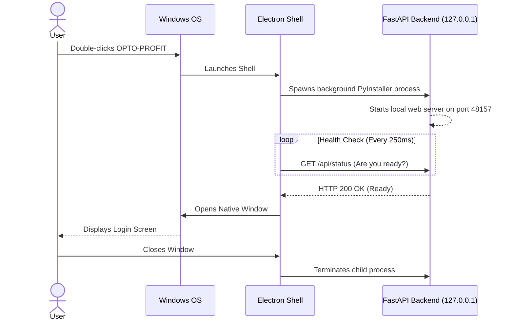

# OPTO-PROFIT: IT & Deployment Guide

This document is written for the client's **IT Department** — the people responsible for installing, securing, and maintaining software across the organization's computers. Every section is explained in plain language so that even non-technical team members can follow along.

---

## Table of Contents

1. [What Is OPTO-PROFIT?](#1-what-is-opto-profit)
2. [Key Terms Explained](#2-key-terms-explained)
3. [System Requirements](#3-system-requirements)
4. [How the Application Works Internally](#4-how-the-application-works-internally)
5. [Installation Procedure](#5-installation-procedure)
6. [Network & Firewall Configuration](#6-network--firewall-configuration)
7. [Security & Data Protection](#7-security--data-protection)
8. [Antivirus & Whitelisting](#8-antivirus--whitelisting)
9. [Data Storage & Backup](#9-data-storage--backup)
10. [Software Updates & Patching](#10-software-updates--patching)
11. [Uninstallation & Data Removal](#11-uninstallation--data-removal)
12. [Troubleshooting Reference](#12-troubleshooting-reference)

---

## 1. What Is OPTO-PROFIT?

OPTO-PROFIT is a **desktop application** used by your engineering and operations teams to optimize assembly line layouts. Think of it as a specialized calculator — users feed in their factory tasks (like "Attach Wheel" or "Test Engine"), and the software figures out the most efficient way to arrange them across workstations.

### Why does this matter for IT?

Unlike most modern software, OPTO-PROFIT is designed to work **completely offline**. It:

- **Does NOT connect to the internet** — ever. Not for login, not for updates, not for analytics.
- **Does NOT send data to any external server** — all information stays on the local hard drive.
- **Does NOT auto-update** — new versions are delivered manually as installer files.

This means your organization's proprietary manufacturing data never leaves the building.

---

## 2. Key Terms Explained

Here is a glossary of technical terms you will encounter in this guide, explained in simple language:

| Term | What It Means |
|------|---------------|
| **Electron** | A technology that lets web applications run as desktop programs with their own window, just like Notepad or Excel. OPTO-PROFIT uses Electron to display its interface. |
| **FastAPI / Sidecar** | The "brain" of the application. It is a small local web server that runs silently in the background on the same computer. It handles all calculations, data saving, and security checks. The user never sees it directly. |
| **PyInstaller** | A packaging tool that bundles the Python-based backend into a single `.exe` file so that end-users do not need to install Python separately. |
| **SQLite** | A lightweight database engine that stores all application data in a single file on the user's hard drive (no separate database server required). |
| **HWID (Hardware ID)** | A unique fingerprint generated from the computer's CPU and motherboard serial numbers. It is used to lock the software license and encrypt the database to that specific machine. |
| **Fernet Encryption** | A strong, industry-standard symmetric encryption method. OPTO-PROFIT uses it to scramble sensitive data in the database so that it cannot be read without the correct key. |
| **PBKDF2** | "Password-Based Key Derivation Function 2" — a mathematical process that converts the HWID into a secure encryption key. It runs 600,000 rounds of computation, making it extremely difficult for an attacker to reverse-engineer the key. |
| **Ed25519** | A modern digital signature algorithm. The license key is signed with Ed25519, which means the application can mathematically prove the license was created by the authorized vendor — without needing an internet connection to check. |
| **`.opto` File** | A JSON-based file format used to export and import project data between machines. This is the only supported method of sharing data between users. |
| **NSIS Installer** | The Windows installer technology used to package OPTO-PROFIT into a standard `.exe` setup wizard (similar to installing Chrome or VLC). |

---

## 3. System Requirements

### Minimum Hardware

| Component | Requirement |
|-----------|-------------|
| **Operating System** | Windows 10 (version 1809 or later) or Windows 11 |
| **Processor (CPU)** | 64-bit, dual-core, 2.0 GHz or faster |
| **RAM** | 4 GB minimum (8 GB recommended) |
| **Disk Space** | 500 MB for installation + space for user data |
| **Display** | 1024 × 700 minimum resolution (1440 × 900 or higher recommended) |
| **Runtime** | Microsoft Edge WebView2 Runtime (usually pre-installed on Windows 10/11) |

### Software Prerequisites

- **No Python installation required** — Python is bundled inside the application.
- **No Node.js installation required** — the frontend is pre-compiled.
- **No database server required** — SQLite is embedded.
- **No internet connection required** — everything runs locally.

### What is WebView2?

WebView2 is a component made by Microsoft that allows desktop applications to display web content. It comes pre-installed on most Windows 10 and all Windows 11 machines. If a user's machine is missing it, the application will attempt to open in the system's default web browser as a fallback. You can install WebView2 manually from [Microsoft's official page](https://developer.microsoft.com/en-us/microsoft-edge/webview2/).

---

## 4. How the Application Works Internally

Understanding the internal architecture will help you diagnose issues and make informed security decisions. Here is what happens when a user double-clicks the OPTO-PROFIT icon:

### Step-by-Step Startup Sequence



### Why 127.0.0.1:48157?

- `127.0.0.1` (also called "localhost") is a special network address that means "this computer only." No other computer on your network can access it.
- `48157` is the specific port number chosen for the backend. It was selected to avoid conflicts with common services. Think of it like a specific room number inside the computer — it only matters internally.

---

## 5. Installation Procedure

### For IT Administrators (Deploying to Multiple Machines)

1. **Obtain the Installer:** You will receive a file named something like `OPTO-PROFIT-Setup-1.0.0.exe`.
2. **Run the Installer:** Double-click the `.exe` file. The NSIS installer will guide you through:
   - Accepting the license agreement.
   - Choosing an installation directory (default: `C:\Program Files\OPTO-PROFIT\`).
   - Creating a Desktop shortcut.
3. **Silent/Unattended Installation (Optional):** For mass deployment via tools like SCCM, PDQ Deploy, or Group Policy, you can run the installer silently:
   ```
   OPTO-PROFIT-Setup-1.0.0.exe /S
   ```
   The `/S` flag (capital S) tells the NSIS installer to run without showing any windows or prompts. The application will install to the default directory automatically.
4. **Post-Install:** No restart is required. The application is ready to use immediately.

### What Gets Installed Where?

| Location | Contents |
|----------|----------|
| `C:\Program Files\OPTO-PROFIT\` | The main application files (Electron shell, bundled backend `.exe`, frontend assets). This is read-only after installation. |
| `%APPDATA%\OPTO-PROFIT\` | User-specific data directory. Contains `data.db` (the SQLite database), `license.dat` (the activated license file), and backup files. Created automatically on first launch. |

> **What is `%APPDATA%`?**
> It is a Windows shortcut that points to a hidden folder specific to each Windows user account. For example, if the Windows username is "JohnDoe", it typically resolves to:
> `C:\Users\JohnDoe\AppData\Roaming\`
>
> You can type `%APPDATA%` into the Windows Explorer address bar to navigate there quickly.

---

## 6. Network & Firewall Configuration

### Does OPTO-PROFIT need any firewall rules?

**No.** Under normal operation, OPTO-PROFIT does not make any outbound (internet-facing) network connections. The only network activity is between two processes on the same machine (Electron ↔ Backend) over `127.0.0.1:48157`.

### What if Windows Firewall shows a popup?

When the application first launches, Windows Defender Firewall may display a prompt asking whether to allow `OPTO-PROFIT.exe` to communicate on the network. This is because the backend opens a listening socket (port 48157).

**Recommended action:**
- **Allow on Private networks** — This is safe. The socket only binds to `127.0.0.1` (localhost) and cannot be reached externally.
- **Deny on Public networks** — This is optional but provides an extra layer of defense.

### Can the application be used on an air-gapped network?

**Yes.** The application was specifically designed for air-gapped environments (networks with zero internet access). There are no hidden update checks, telemetry pings, or cloud dependencies. You can deploy it on machines that have never been connected to the internet.

---

## 7. Security & Data Protection

This section explains the multiple layers of security built into OPTO-PROFIT.

### 7.1 Layer 1: Hardware-Locked Licensing

**What it does:** Prevents the software from being used on unauthorized machines.

**How it works (in simple terms):**
1. When OPTO-PROFIT is installed on a computer, it reads the CPU serial number and motherboard serial number using a built-in Windows tool.
2. It combines these two numbers and runs them through a mathematical formula (SHA-256 hash) to produce a short, unique code called the **Hardware ID (HWID)** — for example, `27CCE96460FFE11E`.
3. The software vendor creates a **License Key** that is mathematically linked to this specific HWID and digitally signed.
4. When the user enters the License Key, the application checks two things:
   - "Was this key genuinely created by the vendor?" (digital signature check)
   - "Was this key made for *this specific computer*?" (HWID comparison)
5. If both checks pass, the license is saved locally and the software unlocks.

**Why this matters for IT:**
- Users cannot share license keys between machines.
- Copying the application folder to a USB drive and running it on another PC will not work.
- No internet or license server is required for verification.

### 7.2 Layer 2: Database Encryption (Data-at-Rest Protection)

**What it does:** Ensures that even if someone physically steals the database file, they cannot read the data.

**How it works (in simple terms):**
1. The application takes the computer's HWID and runs it through 600,000 rounds of a key-stretching algorithm (PBKDF2) to produce a strong encryption key.
2. Every time sensitive data is saved to the database (such as user names, emails, phone numbers, task definitions, and project configurations), it is automatically encrypted using the **Fernet** encryption method before being written to disk.
3. Every time data is read from the database, it is automatically decrypted in memory.
4. This happens transparently — the user never sees or interacts with the encryption process.

**What happens if someone copies the database to another computer?**
The other computer has a different HWID, which produces a completely different encryption key. When the application on the other computer tries to read the database, it cannot decrypt the data. The sensitive fields will appear as meaningless scrambled text.

### 7.3 Layer 3: Session Security

**What it does:** Protects the user's login session.

**How it works:**
- User passwords are hashed using **bcrypt** (an industry-standard one-way hashing algorithm). The original password is never stored anywhere.
- Login sessions use **JWT tokens** (JSON Web Tokens) stored in secure, HttpOnly cookies. This means:
  - The token cannot be read by JavaScript running in the browser (protection against XSS attacks).
  - The token automatically expires after 24 hours, requiring the user to log in again.
- Session secrets are derived from the machine's HWID, so stolen session tokens cannot be replayed on a different machine.

### 7.4 Layer 4: Security Headers & Rate Limiting

**What it does:** Protects against common web application attacks.

| Header / Feature | What It Prevents |
|-----------------|------------------|
| `X-Content-Type-Options: nosniff` | Prevents the browser from guessing file types (which can lead to executing malicious files). |
| `X-Frame-Options: DENY` | Prevents the application from being embedded inside another website (protection against "clickjacking"). |
| `X-XSS-Protection: 1; mode=block` | Tells the browser to block pages if a cross-site scripting attack is detected. |
| `Referrer-Policy: strict-origin-when-cross-origin` | Limits how much information about the user's browsing is shared with other sites. |
| **Rate Limiting** | If someone tries to brute-force a login (guessing passwords rapidly), the application will block further attempts after too many failures and return a "429 Too Many Requests" error. |

### 7.5 Summary: What Data Is Encrypted?

| Data Type | Encrypted on Disk? | Method |
|-----------|:-------------------:|--------|
| User emails | ✅ Yes | Fernet (HWID-derived key) |
| User full names | ✅ Yes | Fernet (HWID-derived key) |
| User phone numbers | ✅ Yes | Fernet (HWID-derived key) |
| Task names & definitions | ✅ Yes | Fernet (HWID-derived key) |
| Project configurations | ✅ Yes | Fernet (HWID-derived key) |
| Profile snapshots | ✅ Yes | Fernet (HWID-derived key) |
| User passwords | 🔒 Hashed (one-way) | bcrypt — cannot be reversed |
| Session tokens | 🔒 Hashed (one-way) | SHA-256 — cannot be reversed |
| Usernames, role, tenant ID | ❌ No (plaintext) | Stored as-is (non-sensitive operational data) |

---

## 8. Antivirus & Whitelisting

### Why might antivirus software flag OPTO-PROFIT?

Enterprise antivirus products (such as CrowdStrike, Symantec, or Windows Defender) sometimes flag OPTO-PROFIT as suspicious. **This is a false positive.** It happens because:

1. **PyInstaller bundling:** The backend is compiled using PyInstaller, which packages Python code into a single `.exe` file. Many legitimate applications use PyInstaller, but some malware does too, so antivirus software is cautious.
2. **Electron framework:** Electron applications spawn child processes (the backend `.exe`), which can look like suspicious behavior to antivirus heuristics.
3. **Local network socket:** The backend opens a listening port on `127.0.0.1:48157`. Some antivirus products flag any application that opens a network listener.

### Recommended Whitelisting Actions

To prevent false positives from disrupting your users, add the following exclusions to your antivirus / endpoint protection platform:

| What to Whitelist | Path |
|-------------------|------|
| **Main Application** | `C:\Program Files\OPTO-PROFIT\OPTO-PROFIT.exe` |
| **Backend Sidecar** | `C:\Program Files\OPTO-PROFIT\resources\OPTO-PROFIT.exe` (the PyInstaller binary inside the Electron resources folder) |
| **Data Directory** | `%APPDATA%\OPTO-PROFIT\` (contains the encrypted database and license file) |
| **Temporary Extraction** | `%TEMP%\_MEI*` (PyInstaller extracts temporary files here on each launch — this folder is cleaned up automatically) |

> **Important:** Only whitelist the specific paths listed above. Do NOT create blanket exclusions for entire drives or the `Program Files` directory.

---

## 9. Data Storage & Backup

### Where is user data stored?

All user data is stored in a single SQLite database file:

```
%APPDATA%\OPTO-PROFIT\data.db
```

This file contains everything: user accounts, tasks, configurations, project profiles, and session records. It is encrypted as described in Section 7.2.

### Automatic Backup System

OPTO-PROFIT includes a built-in automatic backup system that runs every time the application starts:

1. **Rolling Backups:** The application maintains up to **5 rolling backup copies** of the database:
   - `data.db.bak1` — Most recent backup (from the last launch)
   - `data.db.bak2` — Second most recent
   - `data.db.bak3` — Third most recent
   - `data.db.bak4` — Fourth most recent
   - `data.db.bak5` — Oldest backup
2. **Rotation:** Each time the app launches, the existing backups are shifted (bak4 becomes bak5, bak3 becomes bak4, etc.), and the current `data.db` is copied to `data.db.bak1`.
3. **Integrity Check:** Before creating a backup, the application runs `PRAGMA integrity_check` on the database to verify it is not corrupted.

### Manual Backup Recommendations

For additional protection, your IT department should consider:
- Including `%APPDATA%\OPTO-PROFIT\` in your organization's regular file backup schedule (e.g., nightly backups to a network share or tape).
- **Important:** Backup copies of `data.db` are still encrypted with the machine's HWID. They can only be restored to the **same machine** (or a machine with the same hardware). To move data to a different machine, users must use the `.opto` file export feature.

### License File

The activated license is stored at:

```
%APPDATA%\OPTO-PROFIT\license.dat
```

This is a plain-text file containing the cryptographic license key string. It is safe to include in backups, but it will only function on the machine with the matching HWID.

---

## 10. Software Updates & Patching

### How are updates delivered?

Because OPTO-PROFIT has **no auto-update mechanism**, all updates are delivered manually:

1. The vendor will provide a new installer file (e.g., `OPTO-PROFIT-Setup-1.1.0.exe`).
2. **You do NOT need to uninstall the previous version first.** Running the new installer will upgrade the application in-place, preserving the existing database and license.
3. After the update, users can launch the application normally.

### Will updates affect user data?

- **Database:** User data (`data.db`) is stored in `%APPDATA%` and is NOT touched by the installer. All data is preserved.
- **License:** The `license.dat` file is also preserved. Users do NOT need to re-activate after an update (unless the update changes the licensing system, which the vendor will communicate in advance).

### Update Deployment for Multiple Machines

For organizations with many workstations, you can use the same silent installation method:
```
OPTO-PROFIT-Setup-1.1.0.exe /S
```
This can be scripted and deployed through your existing software distribution tools (SCCM, PDQ Deploy, Intune, etc.).

---

## 11. Uninstallation & Data Removal

### Standard Uninstallation

1. Open **Windows Settings → Apps → Apps & Features**.
2. Search for "OPTO-PROFIT".
3. Click **Uninstall** and follow the prompts.

This removes the application files from `C:\Program Files\OPTO-PROFIT\`.

### Silent Uninstallation

For mass removal via deployment tools:
```
"C:\Program Files\OPTO-PROFIT\Uninstall OPTO-PROFIT.exe" /S
```

### Complete Data Removal

The standard uninstaller removes the application but **does NOT delete user data** (to prevent accidental data loss). To fully remove all traces:

1. Uninstall the application (as described above).
2. Manually delete the data directory:
   ```
   rmdir /s /q "%APPDATA%\OPTO-PROFIT"
   ```
3. This removes the database, license file, and all backup copies permanently.

> **Warning:** Once the data directory is deleted, all user data on that machine is irrecoverably lost. Ensure you have exported any needed projects via `.opto` files before performing this step.

---

## 12. Troubleshooting Reference

This section covers common issues and their solutions.

### Issue: Application window does not appear

**Symptoms:** The application seems to launch (process appears in Task Manager) but no window is displayed.

**Cause:** The WebView2 runtime is missing or corrupted.

**Solution:**
1. Download and install the Microsoft Edge WebView2 Runtime from Microsoft's official website.
2. Restart the computer.
3. Try launching OPTO-PROFIT again.
4. If the window still does not appear, the application will automatically fall back to opening in the user's default web browser (Chrome, Edge, Firefox, etc.).

---

### Issue: "License not activated" error even after entering a valid key

**Symptoms:** The user enters the license key and clicks Activate, but the application still shows the activation screen.

**Possible Causes:**
1. **Wrong HWID:** The license key was generated for a different machine. Verify the HWID displayed on the activation screen matches the HWID that was sent to the vendor.
2. **Expired License:** The license key has passed its expiration date. Contact the vendor for a renewal.
3. **Write Permission Error:** The application cannot write `license.dat` to `%APPDATA%\OPTO-PROFIT\`. Ensure the user has write permissions to their own AppData folder.

---

### Issue: Antivirus quarantined the application

**Symptoms:** The application disappears, fails to launch, or shows "file not found" errors after antivirus runs.

**Solution:**
1. Open your antivirus software's quarantine/history.
2. Restore the quarantined file.
3. Add the exclusions described in Section 8 (Antivirus & Whitelisting).
4. Re-install the application if files were permanently deleted.

---

### Issue: "Session expired — please log in again"

**Symptoms:** The user is suddenly logged out while working.

**Cause:** Login sessions automatically expire after **24 hours** for security. This is by design.

**Solution:** The user simply needs to log in again. No data is lost.

---

### Issue: Database appears corrupted

**Symptoms:** The application shows errors when trying to load data, or behaves unexpectedly.

**Solution:**
1. Close OPTO-PROFIT completely.
2. Navigate to `%APPDATA%\OPTO-PROFIT\`.
3. Rename the current `data.db` to `data.db.broken`.
4. Copy the most recent backup (`data.db.bak1`) and rename it to `data.db`.
5. Relaunch the application. The data will be restored to the state it was in at the last launch.

---

### Issue: User forgot their password

**Symptoms:** The user cannot log in because they forgot their password.

**Solution:** An administrator or another user with access can use the password reset functionality within the application. If no other users have access, the IT team may need to work with the vendor to manually reset the password in the database.

---

### Log Files & Support Escalation

When contacting the vendor for support, please provide:
1. **The exact error message** displayed on screen (a screenshot is ideal).
2. **The HWID** of the affected machine.
3. **The application version number** (visible on the login or settings screen).
4. **Any relevant log output** from the application console (if running the debug build).

---

*Document Version: 1.0 — Prepared for OPTO-PROFIT Client IT Department*
