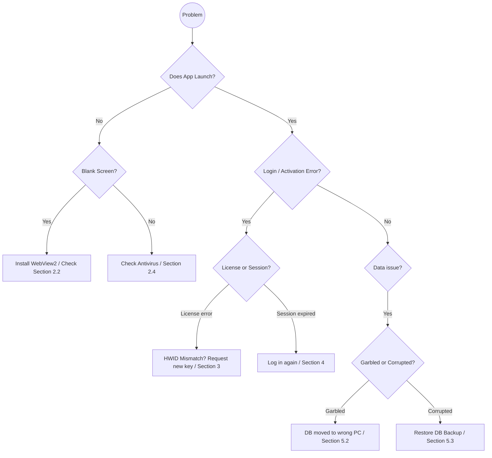

# OPTO-PROFIT: Troubleshooting & Support Guide

This guide is designed for **end-users and IT support staff**. It covers every common problem you may encounter while using OPTO-PROFIT, explains why the problem happens in plain language, and provides clear step-by-step solutions. Keep this document handy as a first point of reference before contacting the vendor.

---

## Table of Contents

1. [Key Terms You'll See in Error Messages](#1-key-terms-youll-see-in-error-messages)
2. [Installation & Launch Problems](#2-installation--launch-problems)
3. [Licensing & Activation Problems](#3-licensing--activation-problems)
4. [Login & Authentication Problems](#4-login--authentication-problems)
5. [Data & Project Problems](#5-data--project-problems)
6. [Performance Problems](#6-performance-problems)
7. [How to Collect Information for a Support Ticket](#7-how-to-collect-information-for-a-support-ticket)
8. [Contact & Escalation](#8-contact--escalation)

---

## Quick Triage Flowchart



---

## 1. Key Terms You'll See in Error Messages

When something goes wrong, the application may display technical-sounding error messages. Here is what the most common terms mean:

| Term in Error Message | What It Means in Simple Language |
|-----------------------|----------------------------------|
| **"License not activated"** | The software has not been unlocked for this computer yet. You need to enter a valid License Key. |
| **"Session expired"** | You have been logged in for more than 24 hours (or 10 minutes for a temporary 2FA session). The system logged you out for security. Simply log in again. |
| **"Not authenticated"** | The application cannot find your login session. This typically means your session cookie was cleared (e.g., by clearing browser data) or you were never logged in. |
| **"Invalid token"** | The login token stored on your computer is damaged or was created on a different machine. Log in again to get a fresh token. |
| **"2FA verification required"** | You have Two-Factor Authentication enabled on your account. You need to enter the 6-digit code from your authenticator app (e.g., Google Authenticator) to complete login. |
| **"Too Many Requests" (429)** | You have made too many requests in a short time (e.g., too many login attempts). Wait a few minutes and try again. This is a security feature to prevent brute-force attacks. |
| **"HWID mismatch"** | The License Key you entered was created for a different computer. You need a new key matched to this computer's Hardware ID. |
| **"Integrity check failed"** | The database file may be corrupted. See Section 5.3 for recovery steps. |

---

## 2. Installation & Launch Problems

### 2.1 Problem: The installer fails or shows an error

**Why it happens:** The installer needs permission to write files to `C:\Program Files\`. If your user account does not have administrator privileges, Windows will block the installation.

**Solution:**
1. Right-click the installer file (e.g., `OPTO-PROFIT-Setup-1.0.0.exe`).
2. Select **"Run as administrator"**.
3. If prompted by User Account Control (UAC), click **Yes**.
4. The installation should now proceed normally.

**Still not working?** Ask your IT administrator to install the software for you, or request temporary admin rights.

---

### 2.2 Problem: The application launches but shows a blank white screen

**Why it happens:** The application's user interface is rendered using a component called **WebView2** (made by Microsoft). If WebView2 is missing or outdated on your computer, the interface cannot display.

**What is WebView2?** Think of it as a small, invisible web browser built into your computer that other applications use to display their interfaces. Most Windows 10 and all Windows 11 computers have it pre-installed.

**Solution:**
1. Download the WebView2 Runtime from Microsoft's official website.
2. Install it by running the downloaded file.
3. Restart your computer.
4. Launch OPTO-PROFIT again.

**Fallback:** If WebView2 still does not work, OPTO-PROFIT will automatically open in your default web browser (Chrome, Edge, Firefox) as a backup. You can use the application normally this way.

---

### 2.3 Problem: The application takes a long time to start (more than 20 seconds)

**Why it happens:** When the application launches, a background process (called the "backend server") needs to start up. This process unpacks several files into a temporary folder, initializes the database, and runs security checks. On older hard drives (non-SSD), this can take longer.

**What is happening during startup?**
1. The backend is being extracted from the compressed `.exe` file to a temporary location.
2. The database is being opened and its integrity is being checked.
3. A backup copy of the database is being created automatically.
4. The licensing system is verifying your activation status.

**Solution:**
- **Wait patiently** — the first launch after installation or a reboot is typically the slowest (up to 20 seconds). Subsequent launches are faster.
- If the application **never** opens (stuck for more than 60 seconds), check if your antivirus is scanning or blocking the extraction process. See Section 2.4.

---

### 2.4 Problem: Antivirus software blocks or quarantines the application

**Why it happens:** OPTO-PROFIT's backend is packaged using a tool called **PyInstaller**, which compresses Python code into a single `.exe` file. Unfortunately, some malware also uses this technique. Because of this similarity, antivirus software may incorrectly flag the application as suspicious. **This is a false positive** — the application is safe.

**Solution:**
1. Open your antivirus software (e.g., Windows Defender, Norton, McAfee, CrowdStrike).
2. Check the **Quarantine** or **Threat History** section.
3. If you see OPTO-PROFIT listed, select it and choose **"Restore"** or **"Allow on device"**.
4. Add the following paths to your antivirus **exclusion/whitelist**:

| What to Exclude | Path |
|-----------------|------|
| Main application folder | `C:\Program Files\OPTO-PROFIT\` |
| User data folder | `%APPDATA%\OPTO-PROFIT\` |
| Temporary extraction folder | `%TEMP%\_MEI*` |

5. Re-install the application if files were permanently deleted by the antivirus.

> **What is `%TEMP%\_MEI*`?** When the backend `.exe` launches, PyInstaller extracts its internal files to a temporary folder whose name starts with `_MEI` followed by random numbers. This folder is automatically cleaned up when the application closes.

---

## 3. Licensing & Activation Problems

### 3.1 Problem: "License not activated" appears on every launch

**Why it happens:** The application checks for a valid license file (`license.dat`) every time it starts. If the file is missing, damaged, or doesn't match the current computer, this screen will appear.

**Solution — First-time activation:**
1. On the License Activation screen, find your **Hardware ID (HWID)** — a 16-character code displayed on screen.
2. Click the **Copy** button next to it.
3. Send this HWID to your IT administrator or the OPTO-PROFIT vendor to request a License Key.
4. Once you receive the License Key (a long string of characters), paste it into the input field on the activation screen.
5. Click **Activate**.

**Solution — Previously activated but now showing this error:**
This means your `license.dat` file was deleted or corrupted. Common causes:
- An antivirus scan quarantined the file.
- A Windows cleanup tool removed files from `%APPDATA%`.
- A system restore rolled back your user profile.

To fix: Re-enter your License Key. If you no longer have it, contact the vendor with your HWID to request a re-issue.

---

### 3.2 Problem: "HWID mismatch" or license rejected after hardware change

**Why it happens:** Your License Key is mathematically locked to your computer's CPU and motherboard serial numbers. If either of these components is replaced (e.g., during a hardware repair or PC upgrade), the computer generates a different HWID, and the old license no longer matches.

**What changes the HWID?**
| Change | Does It Affect HWID? |
|--------|:--------------------:|
| Replacing the motherboard | ✅ Yes |
| Replacing the CPU | ✅ Yes |
| Adding more RAM | ❌ No |
| Replacing the hard drive / SSD | ❌ No |
| Replacing the graphics card | ❌ No |
| Reinstalling Windows | ❌ No |
| Windows updates | ❌ No |

**Solution:**
1. Launch OPTO-PROFIT on the repaired/upgraded machine.
2. Note the **new HWID** displayed on the activation screen.
3. Contact the vendor and provide:
   - Your name / company.
   - The old HWID (if available).
   - The new HWID.
4. The vendor will issue a replacement License Key for the new hardware.

---

### 3.3 Problem: License has expired

**Why it happens:** If you purchased a time-limited license (e.g., 1 year), the application will lock when the expiration date passes.

**What happens to your data?** Your data is **NOT deleted**. It remains safely encrypted on your hard drive. You simply cannot access the application until a new license is provided.

**Solution:**
1. Contact the vendor to purchase a license renewal.
2. The vendor will issue a new License Key with an updated expiration date.
3. Enter the new key on the activation screen.

---

## 4. Login & Authentication Problems

### 4.1 Problem: "Session expired — please log in again"

**Why it happens:** For security, every login session automatically expires after **24 hours**. After this time, the application requires you to log in again.

**Is this a bug?** No. This is an intentional security feature. If someone gained access to your computer while you were away, the automatic expiration limits how long they could use your session.

**Solution:** Simply log in again with your username and password. No data is lost.

---

### 4.2 Problem: Forgot password

**Why it happens:** It happens to everyone.

**Solution (if password reset is configured):**
1. On the login screen, click **"Forgot Password"**.
2. Enter the email address associated with your account.
3. Follow the reset instructions.

**Solution (if no email is configured or reset is unavailable):**
Because OPTO-PROFIT is offline, there is no email server to send a reset link. In this case:
1. Contact your IT administrator.
2. The administrator can work with the vendor to manually reset your password in the database.

---

### 4.3 Problem: Two-Factor Authentication (2FA) code is rejected

**Why it happens:** The 6-digit code from your authenticator app (e.g., Google Authenticator, Microsoft Authenticator) changes every 30 seconds. If there is a time difference between your computer's clock and your phone's clock, the codes may not match.

**What is 2FA?** Two-Factor Authentication is an extra security step. After entering your password, you also need to enter a short-lived code from your phone. Even if someone steals your password, they cannot log in without your phone.

**Solution:**
1. Make sure your **phone's clock is set to automatic** (Settings → Date & Time → Automatic).
2. Make sure your **computer's clock is accurate** (right-click the clock in the Windows taskbar → Adjust date/time → Set time automatically).
3. Wait for a **new code** to appear in your authenticator app (they refresh every 30 seconds) and enter it promptly.

---

### 4.4 Problem: "Too Many Requests" (HTTP 429) error on login

**Why it happens:** OPTO-PROFIT has a built-in security feature called **Rate Limiting**. If you (or someone else) tries to log in too many times in a short period (e.g., more than 3 attempts per minute), the application temporarily blocks further login attempts.

**Why does this exist?** It prevents "brute-force" attacks — where an attacker tries thousands of password combinations rapidly.

**Solution:**
1. **Wait 1–2 minutes** and try again.
2. If your account is locked (after 5 consecutive failures), you will need to wait **15 minutes** for the lockout to expire automatically.
3. If you still cannot log in, contact your IT administrator to check if your account has been permanently locked.

---

## 5. Data & Project Problems

### 5.1 Problem: Imported `.opto` file does not load correctly

**Why it happens:** The `.opto` file may have been created by a different version of the application, or the file may have been corrupted during transfer (e.g., email attachment truncation).

**What is an `.opto` file?** It is a special file format used by OPTO-PROFIT to export and share project data between computers. Inside, it is simply a JSON text file containing your tasks, configurations, and settings.

**Solution:**
1. Ask the sender to **re-export** the file and send it again.
2. Make sure the file was transferred without modification (use a USB drive instead of email if possible, as some email systems modify attachments).
3. Try opening the `.opto` file in a text editor (like Notepad). If the contents look like garbled characters instead of structured data, the file is corrupted.

---

### 5.2 Problem: Data appears as scrambled/garbled text

**Why it happens:** This is the **database encryption** working as intended. If the database file (`data.db`) was moved from one computer to another, the encryption keys no longer match because each computer has a unique Hardware ID.

**Solution:**
- This is **not recoverable** on the wrong machine. The data can only be read on the original computer.
- To properly move data between machines, always use the **Export Profile** feature (`.opto` files) from within the application, which exports unencrypted, readable data.

---

### 5.3 Problem: Database appears corrupted

**Why it happens:** Database corruption is rare but can occur due to:
- A sudden power outage while the application was saving data.
- The computer's hard drive developing bad sectors.
- Antivirus software interfering with file writes.

**Solution — Restore from automatic backup:**
1. Close OPTO-PROFIT completely.
2. Open Windows Explorer and navigate to `%APPDATA%\OPTO-PROFIT\`.
   (Type `%APPDATA%\OPTO-PROFIT` into the address bar and press Enter.)
3. You will see files like:
   ```
   data.db          ← Current database (corrupted)
   data.db.bak1     ← Most recent backup
   data.db.bak2     ← Second most recent backup
   data.db.bak3     ← Third most recent backup
   data.db.bak4     ← Fourth most recent backup
   data.db.bak5     ← Oldest backup
   ```
4. Rename the corrupted file: Change `data.db` to `data.db.broken`.
5. Copy the most recent backup: Copy `data.db.bak1` and rename the copy to `data.db`.
6. Launch OPTO-PROFIT. Your data should be restored to its state from the last time the application was opened.

**If all backups are corrupted:** Contact the vendor for advanced database recovery assistance. Provide the `data.db.broken` file and your HWID.

---

## 6. Performance Problems

### 6.1 Problem: The application feels slow or laggy

**Possible causes and solutions:**

| Cause | How to Fix |
|-------|-----------|
| Too many other applications running | Close unused programs to free up RAM. |
| Very large project (hundreds of tasks) | This is expected for complex projects. The application will still function correctly but calculations may take a few extra seconds. |
| Antivirus real-time scanning | Exclude the `%APPDATA%\OPTO-PROFIT\` folder from real-time scanning (see Section 2.4). |
| Mechanical hard drive (HDD) | Consider upgrading to a Solid State Drive (SSD). Database read/write operations are significantly faster on SSDs. |

---

### 6.2 Problem: The optimizer takes too long to calculate

**Why it happens:** The assembly line optimization engine solves what is known as an "NP-hard" problem — a type of mathematical problem where the number of possible solutions grows exponentially with the number of tasks. For 50+ tasks with complex constraints, calculations naturally take more time.

**Solution:**
- This is normal behavior, not a bug.
- The application uses optimized algorithms to minimize computation time, but very large and heavily constrained projects will still require patience.
- Avoid adding unnecessary constraints (zone exclusions, co-locations, separations) unless they are genuinely required.

---

## 7. How to Collect Information for a Support Ticket

When contacting support, providing the right information upfront speeds up resolution dramatically. Please gather the following before reaching out:

### Checklist for Every Support Ticket

| # | Information | Where to Find It |
|---|-------------|-------------------|
| 1 | **Your Hardware ID (HWID)** | Displayed on the License Activation screen, or on the Settings page. |
| 2 | **Application version number** | Displayed on the login screen or in the Settings / About section. |
| 3 | **The exact error message** | Take a **screenshot** (press `Win + Shift + S` on Windows to capture a screenshot). |
| 4 | **Steps to reproduce** | Write down exactly what you were doing when the error occurred (e.g., "I clicked 'Save Profile' after adding 30 tasks"). |
| 5 | **Your Windows version** | Press `Win + R`, type `winver`, press Enter. Note the version and build number. |
| 6 | **Your computer model** | Open Settings → System → About. Note the "Device name" and "Processor". |

---

## 8. Contact & Escalation

### Level 1 — Self-Service
- Consult this Troubleshooting Guide first.
- Check if the issue matches any scenario described above.

### Level 2 — Internal IT Support
- If the issue involves installation, firewall, antivirus, or system permissions, contact your organization's IT Help Desk.

### Level 3 — Vendor Support
- If the issue involves licensing, data corruption, or application bugs, contact the OPTO-PROFIT vendor directly.
- Provide all information from the checklist in Section 7.

---

*Document Version: 1.0 — Prepared for OPTO-PROFIT End-Users and IT Support Staff*
