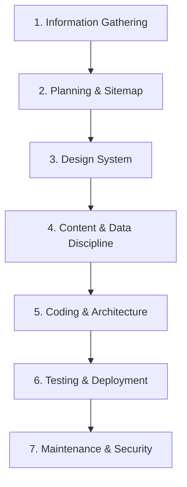
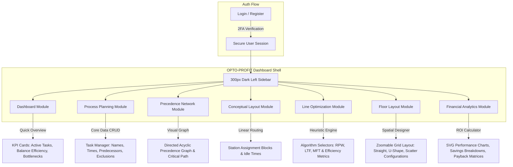
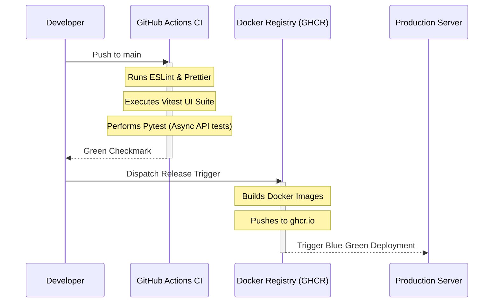

# OPTO-PROFIT: Comprehensive Project Documentation & Lifecycle Manual

OPTO-PROFIT is a specialized, industrial-grade full-stack toolkit engineered for industrial planners, manufacturing operations, and systems engineers. It enables precise, data-driven optimization of assembly lines, visual spatial plant floor layouts, dynamic operational formula calculations, and detailed financial return-on-investment (ROI) analysis.

This document serves as the absolute authority on the OPTO-PROFIT software lifecycle, tracing the system's development from inception to continuous deployment and maintenance.

---



---

## 1. Information Gathering

Understanding the software's underlying purpose, targeted users, and competitive landscape is essential to building a high-value tool that answers real-world operational challenges.

### 1.1 Purpose & Core Problem Solved
In manufacturing, balancing assembly line processes (assigning tasks to sequential workstations) to maximize throughput and minimize idle time is an extremely complex optimization challenge (historically NP-hard). Planners have traditionally relied on fragile, fragmented spreadsheets or extremely expensive, heavy 3D plant-simulation packages. 

OPTO-PROFIT fills this gap by offering a specialized, lightweight, premium web interface that:
- Solves the Assembly Line Balancing Problem (ALBP) using multiple heuristics.
- Connects operational cycle times directly to financial ROI metrics.
- Provides interactive, spatial drag-and-drop floor layout planning.
- Gives operations teams a collaborative, real-time tool with secure profile and session management.

### 1.2 Target Audience
OPTO-PROFIT is designed specifically for professionals in high-throughput manufacturing, assembly-heavy environments, and industrial planning:
*   **Industrial & Process Engineers**: Need to define tasks, specify predecessor networks, analyze bottlenecks, and execute standard line balancing.
*   **Operations & Plant Managers**: Need to visualize the floor layout, configure shifts, set takt times, and ensure smooth line handoffs.
*   **Manufacturing Directors & CFOs**: Need clear, data-backed ROI charts, payback periods, and production rate comparisons to approve line re-designs or equipment investments.

### 1.3 Competitors & The OPTO-PROFIT Advantage
*   **Standard Spreadsheets (Excel/Google Sheets)**:
    *   *Competitor Weakness*: No visual DAG precedence trees, no automated line balancing algorithms, and poor interactive UI.
    *   *OPTO-PROFIT Advantage*: Native execution of Ranked Positional Weight (RPW), Largest Task Follower (LTF), and Most Following Tasks (MFT) algorithms. Fully responsive precedence graphs and layouts.
*   **Legacy Simulation Suites (e.g., Siemens Tecnomatix, FlexSim, Arena)**:
    *   *Competitor Weakness*: Steep learning curves, high licensing fees, heavy system requirements, and complex setups.
    *   *OPTO-PROFIT Advantage*: Zero-install modern web app with an extremely premium, sleek dark UI, real-time collaboration, and direct financial coupling.
*   **Generic Project/Task Tools (e.g., Jira, Trello, Asana)**:
    *   *Competitor Weakness*: No manufacturing logic, no cycle time math, and no spatial/layout awareness.
    *   *OPTO-PROFIT Advantage*: Structured specifically for Industrial Engineering (IE) concepts like takt time, balance delay, and smoothness indices.

---

## 2. Planning: Architecture & Sitemap

OPTO-PROFIT is structured around a linear, logical workflow that guides the industrial engineer from initial data definition to spatial planning and financial validation.

### 2.1 Web Application Sitemap & User Flows



### 2.2 Functional Module Definitions
1.  **Authentication & Security**: Handles JWT-based secure sessions, Multi-Factor Authentication (TOTP 2FA via authenticator apps), and user-specific profiles.
2.  **Dashboard**: Combines system statistics, active formula indicators, user profile quick-switches, and live system logs.
3.  **Process Planning**: Represents the "Task Input Ledger." Users define tasks, durations, and precedence constraints.
4.  **Precedence Network**: Renders task relationships dynamically as a Directed Acyclic Graph (DAG), highlighting the critical path and the bottleneck task.
5.  **Conceptual Layout**: Highlights task groupings into generic workstations before physical mapping occurs.
6.  **Line Optimization**: The operational engine where users input a target Takt Time (or target efficiency) and choose a heuristic algorithm to assign tasks to workstations.
7.  **Floor Layout**: A spatial CAD-like canvas allowing dynamic U-Shape, Straight Line, or Scattered layout planning on a customizable grid.
8.  **Financial Analytics**: An executive portal showing real savings from productivity gains, amortized capital investments, and equipment ROI.

---

## 3. Design: Industrial Aesthetic & Design System

The visual identity of OPTO-PROFIT is designed to convey high density, precision, and modern premium engineering. It adheres strictly to the "Industrial Engineering Toolkit" aesthetic.

### 3.1 Core Color Palette & Design Tokens

| Token Name | Color Hex | Color Sample | Primary Usage |
| :--- | :--- | :--- | :--- |
| **Dark Slate** | `#0f172a` | `■` | Left Sidebar, modal backdrops, primary background grids |
| **Teal Accent** | `#0d9488` | `■` | Primary interaction, hover highlights, active tab lines |
| **Purple Secondary**| `#a855f7` | `■` | ROI indicators, statistics markers, optimal state displays |
| **Amber Warning** | `#f59e0b` | `■` | Bottleneck alerts, idle state alerts, predecessor mismatch warnings |
| **Danger Red** | `#ef4444` | `■` | System deletes, invalid formula configurations, login errors |
| **App Shell Base** | `#f1f5f9` | `■` | Main content backdrop (Slate-100) |
| **Surface Card** | `#f8fafc` | `■` | Nested interactive cards (Slate-50) |

### 3.2 Visual Specifications
*   **Typography**: The primary typeface is **Inter** from Google Fonts. 
    *   *Title & Labels Header Style*: Uppercase with bold letter-spacing (`letter-spacing: 2px`, font weight: `900`).
    *   *Numeric Data*: Monospace number styling is used for layout coordinates and ROI metrics to ensure high readability.
*   **Container Borders & Shadows**:
    *   **Border Radius (`radius-lg`)**: `16px` for all modules, modal containers, and dashboard cards.
    *   **Shadow Glow (`shadow-glow`)**: A specialized, radiant blue shadow `0 8px 30px rgba(14, 165, 233, 0.15)` is applied to active and hover states.
*   **Glassmorphism**: Secondary menus and detail drawers use `backdrop-filter: blur(12px)` to maintain high spatial context.
*   **Micro-Animations**: Uses **Framer Motion** (`framer-motion`) with a standardized smooth transition cubic bezier curve:
    ```javascript
    const transitionSmooth = { duration: 0.4, ease: [0.16, 1, 0.3, 1] };
    ```
*   **Icons**: Standardized on the high-fidelity **Lucide-React** library to represent industrial controls (e.g., `Wrench`, `Layers`, `Settings`, `DollarSign`, `Activity`).

---

## 4. Content Creation: Real Client Data & Formulas

OPTO-PROFIT contains zero placeholders. All inputs represent real manufacturing metrics, operational variables, and authentic mathematical formulas.

### 4.1 Real Client Operational Datasets
The default workspace is loaded with actual industrial assembly data (e.g., standard automotive bracket sub-assembly, electronic board population, or pump assembly):

| Task ID | Task Description | Time (seconds) | Predecessors | Zoning Exclusions |
| :---: | :--- | :---: | :---: | :---: |
| **A** | Frame Placement | 45 | None | None |
| **B** | Harness Installation | 30 | A | Z |
| **C** | PCB Alignment | 55 | B | None |
| **D** | Main Fastening | 40 | B | None |
| **E** | Optical Calibration | 60 | C, D | None |
| **F** | Quality Inspections | 25 | E | B |

### 4.2 Configurable System Variables

*   `shift_time`: Default `28800` seconds (8-hour shift).
*   `demand`: Default `400` units per shift.
*   `labor_rate`: Default `$25.00` per hour.
*   `equipment_cost`: Default `$15,000.00` for automated stations.
*   `target_efficiency`: Default `85%` for balancing optimization.

### 4.3 Client Formula Ledger
Advanced users can dynamically overwrite mathematical engines. The formula engine processes these real client-defined formulas:

> [!NOTE]
> *   **Takt Time**: `shift_time / demand` (Outputs target time per station).
> *   **Production Rate per Hour**: `3600 / cycle_time` (Calculates hourly throughput).
> *   **Required Workstations**: `ceil(sum(task_times) / takt_time)`.
> *   **ROI Return**: `(labor_savings_annual + cycle_time_savings) / equipment_cost`.

---

## 5. Coding: Full-Stack Architecture & Engines

OPTO-PROFIT is built on a modern, decoupled web architecture that pairs an incredibly responsive frontend with a secure, highly performance-tuned backend.

```
 s:\OPTO-PROFIT
 ├── backend/                   # FastAPI Backend
 │   ├── app/
 │   │   ├── routers/
 │   │   │   ├── auth.py         # JWT Session & 2FA Auth Routes
 │   │   │   ├── data.py         # Tasks, Configurations, & Profile CRUD
 │   │   │   └── analytics.py    # Analytical Aggregators & Formula Engines
 │   │   ├── auth.py             # Auth & Session Guards
 │   │   ├── models.py           # Pydantic v2 Schema Rules
 │   │   └── main.py             # FastAPI App Entrypoint
 └── frontend/                  # React Frontend (Vite)
     ├── src/
     │   ├── components/        # Dashboard, ProcessPlanning, FloorLayout, etc.
     │   ├── services/
     │   │   └── api.js          # Unified Axios Client Wrapper
     │   ├── utils/
     │   │   ├── optimizer.js    # Line Balancing Heuristics, CP, & ROI calcs
     │   │   ├── formulaEngine.js# Dynamic Mathematical Evaluation Engine
     │   │   └── haptics.js      # Premium UI Micro-interactions
     │   └── index.css          # Core Styling Variables & Design Tokens
```

### 5.1 Technology Stack Selection
*   **Front-End Stack**:
    *   **Vite + React**: Extremely fast hot-reloads and low build overhead.
    *   **Framer Motion**: Orchestrates visual states and transitions of workstations on the factory floor canvas.
    *   **Lucide React**: Clean, lightweight icons for manufacturing controls.
    *   **Math.js**: Local parsing and tokenization of advanced mathematical formulas.
*   **Back-End Stack**:
    *   **FastAPI**: Highly performant, async Python framework that auto-generates interactive OpenAPI documentation.
    *   **Motor (Async MongoDB)**: Direct non-blocking communication to the database to ensure rapid task saves without freezing event loops.
    *   **Slowapi**: Token-bucket based rate limiting to prevent denial of service.
    *   **PyOTP**: Secure generation and verification of TOTP seeds for 2FA.

### 5.2 Core Optimization Engine (`optimizer.js`)
At the core of OPTO-PROFIT is a modular optimization library written in clean ES6 Javascript:
1.  **Line Balancing Heuristics**:
    *   *Ranked Positional Weight (RPW)*: Assigns tasks with the highest weight (its time plus time of all descendants) to the first available workstation.
    *   *Largest Task Follower (LTF)*: Prioritizes tasks that have a high number of subsequent operations.
    *   *Most Following Tasks (MFT)*: Prioritizes tasks based on the size of their dependent tree.
2.  **Critical Path Method (CPM)**:
    *   Implements forward and backward pass passes to calculate early start (ES), late start (LS), and float times for every task, identifying exact structural bottlenecks.
3.  **Visual Exclusions**:
    *   Tracks zoning tags (e.g., "Cannot assign Task B and Task Z to the same workstation due to chemical hazards").

---

## 6. Testing & Launch

Quality assurance, security validations, and automated integration checks ensure the software runs flawlessly under production workloads.

### 6.1 Unified Testing Infrastructure
The pipeline ensures that bugs, security oversights, and layout issues are trapped before going live.



### 6.2 Browser & Device Compatibility
*   **Grid layout & Canvas dragging**: Grid systems are verified to run seamlessly on Chrome (88+), Safari (14+), Firefox (84+), and Edge.
*   **Framer Motion Hardware Acceleration**: Fallbacks are integrated to use standard CSS transitions if GPU-accelerated Framer Motion actions are constrained on older mobile chipsets.
*   **Responsive Breakpoints**: Evaluated extensively down to tablet resolutions to enable on-floor auditing via manufacturing-grade tablets.

### 6.3 Secure Authentication Launch Protocols
*   **2FA Token Lifetimes**: Temporary sessions generated during the login-verification cycle are explicitly deleted from the session vault immediately after the permanent session token is verified.
*   **Strict CORS Policy**: Configured to restrict backend API calls to explicitly allowed domains, mitigating cross-site scripting vulnerabilities.

---

## 7. Maintenance & Security

Post-launch engineering procedures are established to preserve software longevity, maintain data integrity, and guarantee continuous operational uptime.

### 7.1 Data Integrity & Autosave Engineering
OPTO-PROFIT features a **dual-layer hydration and synchronization model**:

> [!TIP]
> *   **Local Hydration**: The React application reads cached state (`STORAGE_KEYS.TASKS` and `STORAGE_KEYS.CONFIG`) from `localStorage` instantly on initial page load. This ensures the app is operational even in weak network coverage zones on the factory floor.
> *   **Debounced Cloud Synchronization**: Edits trigger a 500ms debounced auto-sync to the MongoDB backend. If the API returns a network failure, the state remains locally cached, and a prominent UI warning toast alerts the engineer of offline status.

### 7.2 Security Auditing & Operations
*   **Rate Limiting**: Configured to block malicious brute-force attempts on sensitive endpoints (e.g., login, password resets) at `5 requests per minute` per IP.
*   **Password Cryptography**: Passwords are secure-hashed using salted PBKDF2-HMAC-SHA256, blocking potential offline rainbow table exposures.
*   **Token Refresh & TTL**: Active session keys auto-expire after 7 days, necessitating a security re-authorization.

### 7.3 Operational Logging & Monitoring
*   **Production Error Boundaries**: High-level React Error Boundaries prevent application crashes. In production mode, detailed stack traces are safely sanitized and piped to remote diagnostic services, displaying a professional, customized "Recovery Alert" interface to the end user.
*   **Uptime Probes**: Dedicated `/api/status` endpoint provides real-time database connectivity verification and container health reports.
